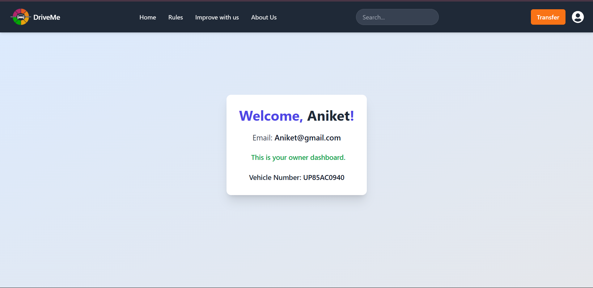
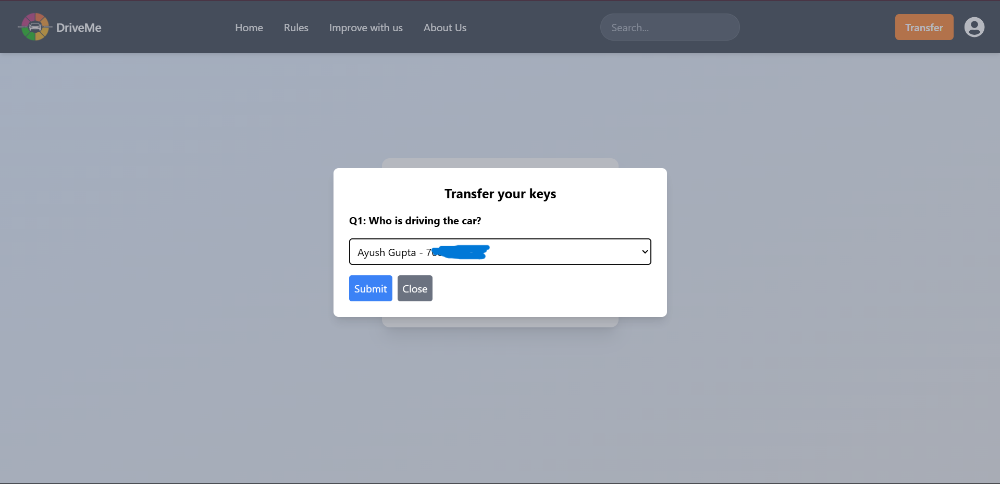
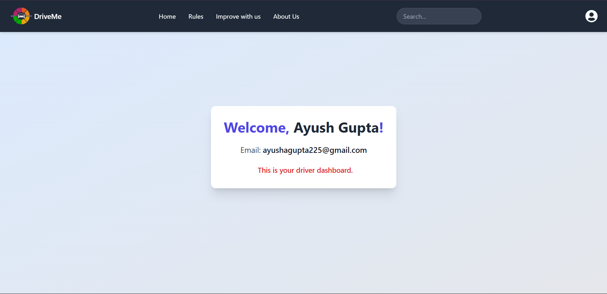
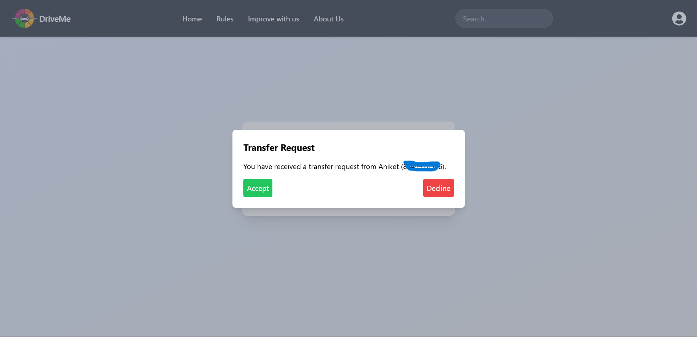

# DriveMe - Vehicle Ownership and Driver Management System

**DriveMe** is a web application designed to manage and track vehicle ownership and driver history, with a focus on role-based access. The system provides two different dashboards based on the user's role: vehicle owner or driver.

## Features

### 1. **Vehicle Owner Dashboard**

- As a **vehicle owner**, you are directed to the **Owner's Dashboard**, where you can **transfer control** of your vehicle to another user.

- A **Transfer** button is available on the dashboard. Upon clicking it, you will be prompted to select from your acquaintances (which can be added via the settings page).

#### Transfer Request UI:

### 2. **Driver Dashboard**

- As a **driver**, there is no transfer control button. Instead, you will receive transfer requests from vehicle owners if they wish to transfer control of their vehicle to you.

- Transfer requests are implemented using **Socket.IO**, allowing real-time communication between the owner and driver.

#### Driver Transfer Request UI:

## Instructions for Testing

Follow the steps below to set up the application locally:

### 1. **Frontend Setup**

- Open the `DriveMe` folder in your preferred code editor.
- Navigate to the `frontend` directory in your terminal:
    cd frontend
  Install the necessary dependencies:
    npm install
  Start the frontend development server:
    npm start
### 2. **Backend Setup**
In another terminal window, navigate to the root directory and then to the backend folder:
    cd ..
    cd backend  
Install the backend dependencies:
    npm install
Start the backend development server:
    npm run dev

Once both frontend and backend are running, you can access the application on http://localhost:3000.
